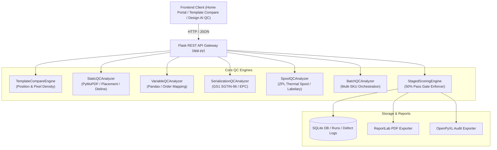

# Architecture & System Design — r-pac Layout QC Automation Suite

## 1. System Architecture Diagram

## 2. Key Modules & Functional Responsibilities

| Module | Core Responsibility | Technologies Used |
| :--- | :--- | :--- |
| **`TemplateCompareEngine`** | Position alignment matching, coordinate tolerance, blur density heatmap | PyMuPDF, OpenCV, NumPy |
| **`StaticQCAnalyzer`** | Fixed artwork specs, font consistency, placement tolerances | PyMuPDF, ReportLab |
| **`VariableQCAnalyzer`** | Dynamic CSV/XLSX variable data mapping & record inspection | Pandas, OpenPyXL |
| **`SerializationQCAnalyzer`** | GS1 SGTIN-96 binary decomposition, company prefix, serial duplicate check | Python bitwise arithmetic |
| **`SpoolQCAnalyzer`** | Thermal barcode printer ZPL stream parsing & 3-way layout validation | Regular expressions, Pillow |
| **`StagedScoringEngine`** | Weighted sector scoring, hard 50% pass gating, PDF audit generation | SQLite3, ReportLab |

## 3. Position vs Pixel Density Matching Logic

1. **Position Match**:
   $$\text{Distance} = \sqrt{(x_{0,A} - x_{0,B})^2 + (y_{0,A} - y_{0,B})^2}$$
   $$\text{Matched if } \text{Distance} \le \text{Tolerance Points (default: } 5.0\text{pt)}$$

2. **Pixel Density Difference**:
   $$\text{Diff}(x,y) = |\text{Blur}_A(x,y) - \text{Blur}_B(x,y)|$$
   $$\text{Heatmap} = \text{ApplyColorMap}(\text{Diff} \times 3, \text{COLORMAP\_JET})$$
